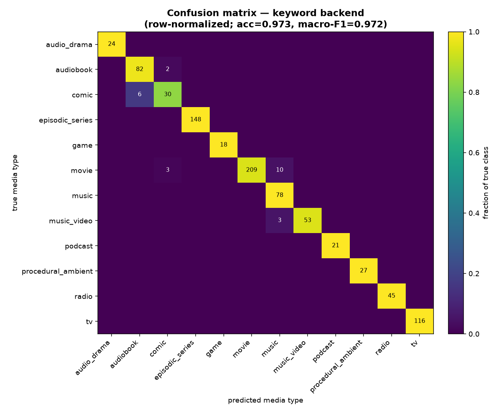
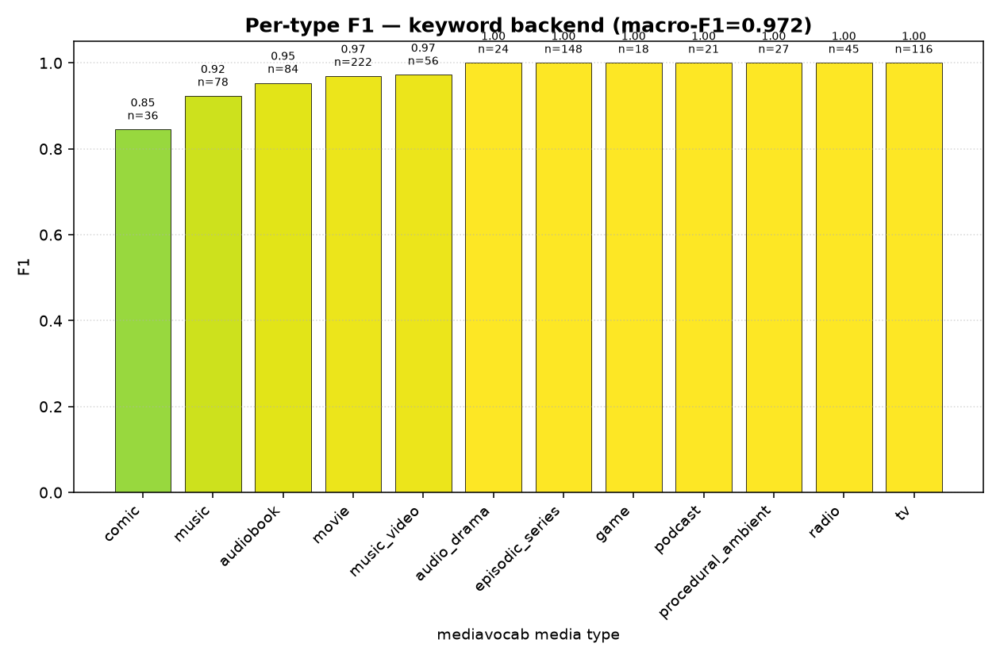
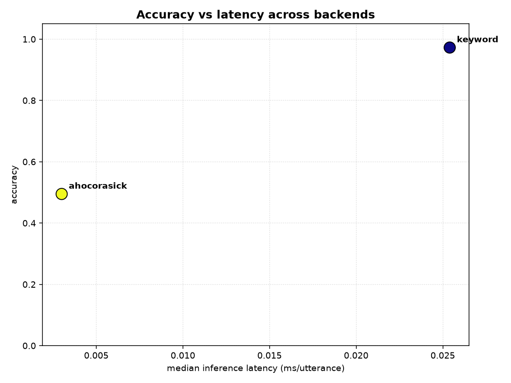
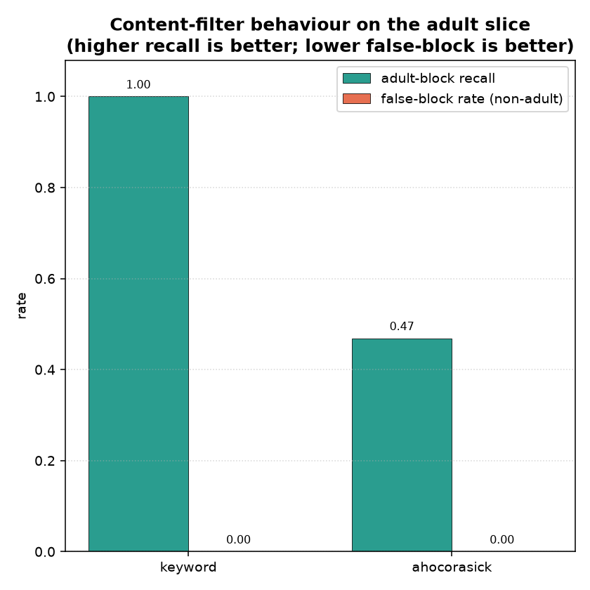

# Benchmarks

A reproducible, network-free harness that evaluates the `ovos-media-classifier`
backends against a labeled eval set and produces a metrics table plus matplotlib
plots.

The suite lives at the repo top level (it is **not** part of the installed
package). Run everything from the repo root with the project venv.

## Quick start

```bash
# metrics only -> benchmarks/results.json + benchmarks/results.md
~/.venvs/ovos/bin/python -m benchmarks.run

# metrics + plots -> also writes docs/benchmarks/*.png
~/.venvs/ovos/bin/python -m benchmarks.run --plots

# regenerate the committed eval set from the bundled .voc files
~/.venvs/ovos/bin/python -m benchmarks.dataset
# or force a rebuild as part of a run
~/.venvs/ovos/bin/python -m benchmarks.run --plots --rebuild-dataset
```

`matplotlib` and `numpy` are required for `--plots` (install into the venv with
`~/.venvs/ovos/bin/pip install matplotlib`).

## Artifacts

| File | What it is |
|---|---|
| `benchmarks/dataset.py` | Builds the deterministic eval set from the bundled `.voc` keyword files. |
| `benchmarks/eval_set.csv` | The committed eval set: `utterance, lang, expected_media_type, expected_genres`. |
| `benchmarks/run.py` | Loads the eval set, runs every available backend, computes metrics + content-filter recall. |
| `benchmarks/plots.py` | Renders the PNGs from the report dict. |
| `benchmarks/results.json` | Machine-readable per-backend metrics + confusion matrices. |
| `benchmarks/results.md` | Human-readable results table (regenerated each run). |
| `docs/benchmarks/*.png` | Plots (see below). |

## How the eval set is built

The ground truth is sourced **entirely from the bundled `.voc` keyword files** —
the same vocabulary the keyword backend ships with — so the benchmark needs no
network and no external dataset. For each `<Type>Keyword.voc`:

1. The voc file name maps to an `OCPPlayIntent` (mirroring the branch order in
   `KeywordMediaClassifier._classify_intent`).
2. That intent maps to a canonical `mediavocab.MediaType` via
   `PLAY_INTENT_TO_MEDIA_TYPE`, and to genre tags via `PLAY_INTENT_TO_GENRES`
   (this is where the `adult` signal comes from).
3. Each keyword phrase is dropped into **modality-consistent** play-style
   templates. The keyword backend is hierarchical (coarse-to-fine): it predicts
   the playback modality from the carrier verb FIRST and constrains the leaf to
   it, so the carrier must agree with the leaf's modality — a video leaf gets a
   "watch …" carrier, an audio leaf a "listen to …" carrier, etc. (no
   self-inflicted "watch a radio" mislabels). Every leaf also gets the neutral
   `"play {kw}"` carriers.

Keyword phrases that are shared across media types (genuinely ambiguous for the
keyword backend) are dropped so the labels stay honest. Sampling uses a fixed
seed (`SEED = 42`) and the CSV is sorted, so it is byte-reproducible. Languages:
`en-us` (mandatory) plus `de-de` and `pt-pt`.

## Backends

Backends needing optional dependencies or trained model files that are not
present in a bare checkout are detected and recorded as **unavailable** (with the
reason) — they never crash the run. The zero-dependency **keyword** backend is
always available. The **ahocorasick** backend is seeded from the bundled keyword
vocs so it produces a meaningful (exact-match) baseline.

To benchmark the ML backends, point the harness at trained artifacts via env
vars: `MEDIA_CLF_SKLEARN_MODEL`, `MEDIA_CLF_PADATIOUS_DIR`, `MEDIA_CLF_M2V_MODEL`,
`MEDIA_CLF_GUIDED_MODEL`.

## Metrics

Per backend: accuracy and macro-F1 over `mediavocab.MediaType`, per-type
precision/recall/F1/support, median + p95 inference latency (ms/utterance) and
rows/sec. Globally: **content-filter recall** — of the adult-genre rows, the
fraction the default `ContentFilter().check(clf, utterance, lang)` blocks — plus
the false-block rate over the non-adult slice.

## Latest results

Eval set: **875 utterances** across 3 languages (`de-de`=277, `en-us`=360,
`pt-pt`=238), **64 adult-genre rows**.

| backend | status | accuracy | macro-F1 | median ms | p95 ms | rows/s | CF recall | false-block |
|---|---|---|---|---|---|---|---|---|
| keyword | available | 0.973 | 0.972 | 0.0254 | 0.0531 | 32700 | 1.000 (64/64) | 0.000 |
| ahocorasick | available | 0.495 | 0.628 | 0.0030 | 0.0055 | 363702 | 0.469 (30/64) | 0.000 |
| sklearn | unavailable | – | – | – | – | – | – | – |
| padatious | unavailable | – | – | – | – | – | – | – |
| model2vec | unavailable | – | – | – | – | – | – | – |
| guided_onnx | unavailable | – | – | – | – | – | – | – |

Notes from this run (hierarchical coarse-to-fine keyword backend):

- The keyword backend's residual errors are lexical-substring artifacts, not
  modality logic: German `audiobeschreibung` ("audio description") contains
  `audio` so it scores as audio (`music`) rather than `movie`; the bare verb
  `read`/`ler` is shared between `AudioBookKeyword` and the paged comic leaf.
- Keyword content-filter recall is **1.000** (64/64) and false-block rate on
  non-adult rows is **0.000** — adult precedence survives the rewrite intact.
- The ahocorasick exact-match baseline now blocks the adult rows whose phrase is
  in the bundled vocab (`classify_genres` surfaces the genre), giving a 0.469
  recall; the remainder use phrases its wordlists do not cover.

See `benchmarks/results.md` for the full per-type tables and
`benchmarks/results.json` for the raw numbers and confusion matrices.

## Plots

All saved under `docs/benchmarks/` at dpi 140.

| Plot | Description |
|---|---|
|  | `confusion_matrix_keyword.png` — true vs predicted media type for the keyword backend (one per available backend). |
|  | `per_type_f1.png` — per-media-type F1 bars for the keyword backend. |
|  | `accuracy_vs_latency.png` — accuracy vs median latency across available backends. |
|  | `content_filter_recall.png` — adult-slice block recall and false-block rate per backend. |
